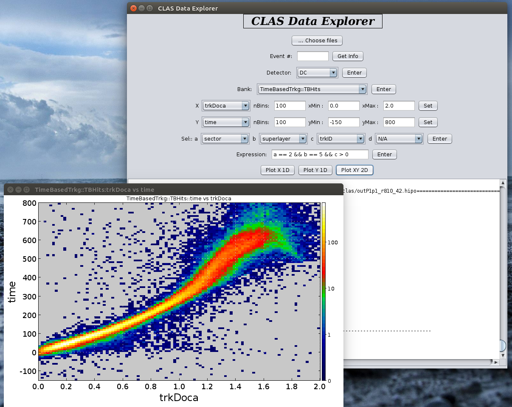

CLAS12 Data Explorer
=======================

Features
----------

 - Make plot of any variable/channel from any bank from any detector sub-system with few clicks 
 - Look at actual numbers of desired event
 - Look into the data from different perspectives
 - Make 1D or 2D histogram of desired variables
 - Apply cut using up to four variables.


Download the executable
-----------------------
A pre-compiled executable ```jar``` file is inside the directory ```target/```. Download that ```jar``` file on your computer and run the program as:

```
java -jar /path/to/DataExplorer.jar
```

It should just work.


Running on JLAB ifarm
---------------------
You can run the pre-compiled compiled jar on ```ifram``` by issuing the following command (assuming you ssh with -Y option):
```
/group/clas12/clas12dc/mclas12 explorer
```

Compilation Instructions
------------------------

If you want to compile on your computer, then do:

1. Download/clone the entire ```CLAS12 Software package```
2. From your IDE(Eclipse) export the Data Explorer package as new project.
3. Add jar from ```clas12lib/``` to your build path.
4. From your IDE (e.g. Eclipse) export to runnable jar

How to use
----------

It should be trivial to use.
Check the presentation [here](https://userweb.jlab.org/~latif/Hall_B/DC_Update_CalCom_meeting_July14_2017.pdf)

**Note:**
- In the cut expression box, you must enter a logical expression in terms of a, b, c or d. 


**Screenshot**



To be done for upcoming updates
-------------------------------

1. Remove redundant enter or set button with auto set upon selection.
2. Use JavaFx instead of Swing for GUI implementation.
3. Add button for XY profile histogram.
