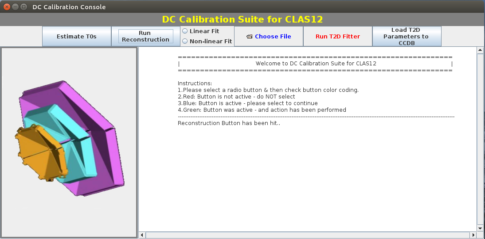
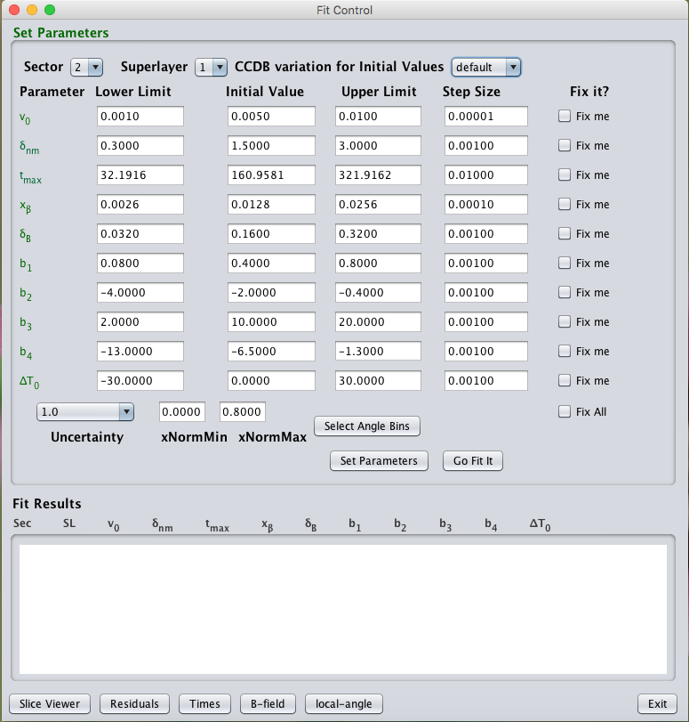

DC Calibration Suite
====================
DC calibration suite for CLAS12.

Source directory structure
--------------------------
The source files are divided into the following modules:
 - constants : Static values used in the suite
 - core : The main routines -- T0 correction estimation, Reconstruction, Calibration 
 - fit : All the fit routine and functions
 - init : All the initialization (prepare histo, graph, data container etc) stuff
 - io : The input/output services
 - benchmark : Scripts used for testing
 - ui : User interface 

The ```main()``` function for the calibration suite is invoked from the ```ui/Application``` class. 


Screenshot: The main GUI
--------------------------



Screenshot: The Fit Control GUI
-------------------------------

